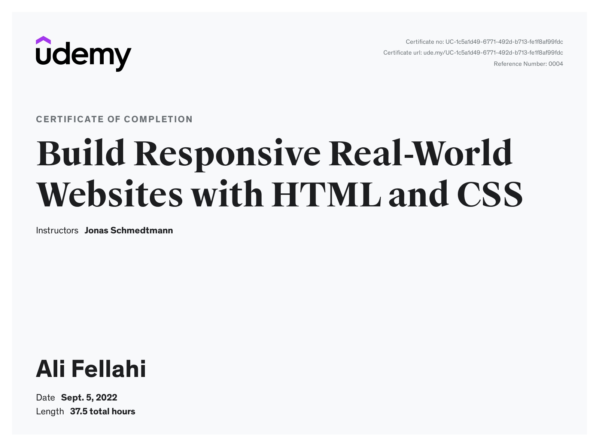

# Build Responsive Real-World Websites with HTML and CSS

## **Challenges**

- [x] [Section 2 – Challenge #2](./Challenges/01-Challenges/)
- [x] [Section 3 – Challenge #1](./Challenges/02-Challenges/)
- [x] [Section 3 – Challenge #2](./Challenges/03-Challenges/)
- [x] [Section 3 – Challenge #3](./Challenges/04-Challenges/)
- [x] [Section 4 – Challenge #1](./Challenges/05-Challenges/)
- [x] [Section 4 – Challenge #2](./Challenges/06-Challenges/)
- [x] [Section 4 – Challenge #3](./Challenges/07-Challenges/)

---

## **Code**

✔ Section 01 | [_**My First Web Page**_ ](01-My-First-Web-Page)

✔ Section 02 | [_**HTML Fundamentals**_](02-HTML-Fundamentals/)

✔ Section 03 | [_**CSS Fundamentals**_](03-CSS-Fundamentals/)

✔ Section 04 | [_**Layouts: Floats, Flexbox, and CSS Grid Fundamentals**_](04-CSS-Layouts//)

✔ Section 05 | [_**Web Design Rules and Framework**_](05-Design/)

✔ Section 06 | [_**Components and Layout Patterns**_](06-Components/)

✔ Section 07 | [_**Omnifood Project – Setup and Desktop Version**_](07-Omnifood-Desktop/)

✔ Section 08 | [_**Omnifood Project – Responsive Web Design**_](08-Omnifood-Responsive/)

✔ Section 09 | [_**Omnifood Project – Effects, Optimizations and Deployment**_](09-Omnifood-Optimization/)

---

## **Final Project:** (_Omnifood_)

- [Project-code](./Projects/Omnifood)  
- [Live Demo](https://omnifood.alilo.dev/)

---

### [Check Course](https://www.udemy.com/course/design-and-develop-a-killer-website-with-html5-and-css3) | [Check Certificate](https://www.udemy.com/certificate/UC-1c5a1d49-6771-492d-b713-fe1f8af99fdc/)

